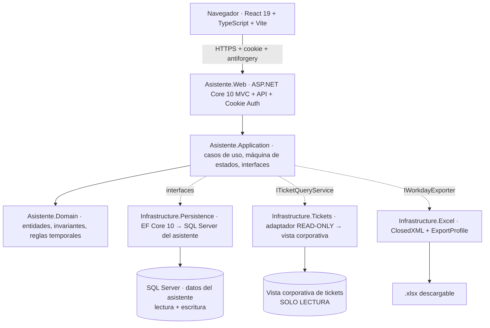
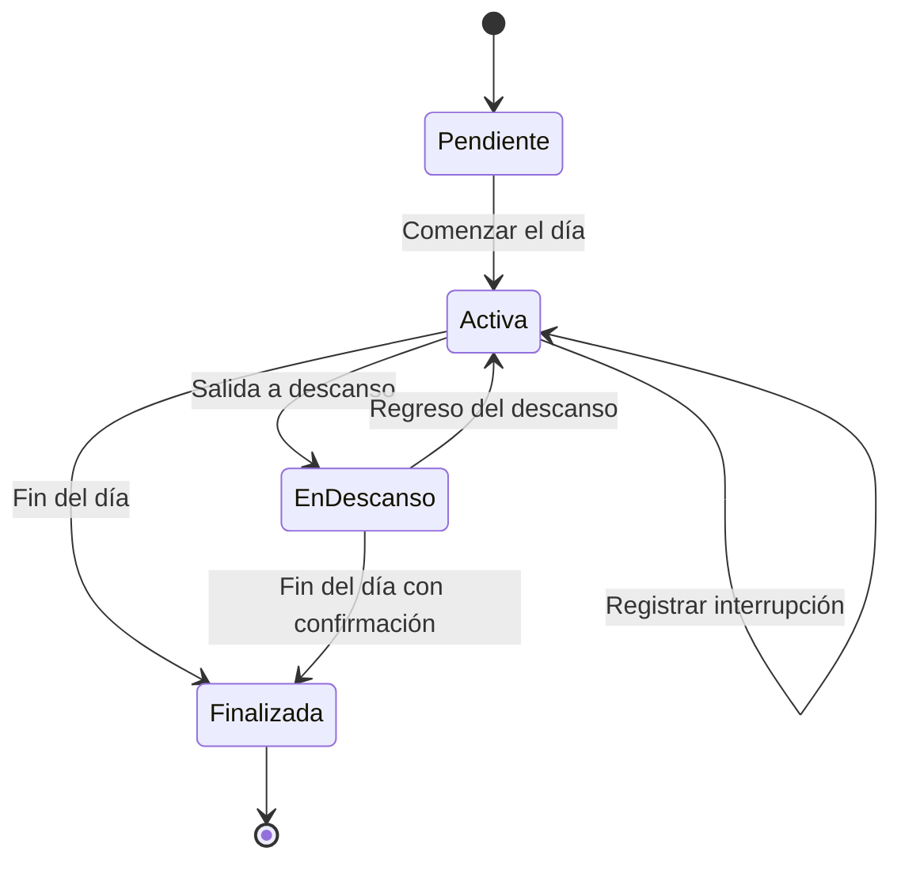

# Plan de Implementación — Asistente Web de Registro de Tareas

**Base:** Especificación de Requerimientos v2.0 (15/08/2026)
**Repositorio:** `C:\TESIS\sistema-tickets` (greenfield, sin commits)
**Stack objetivo:** .NET 10 LTS / C# 14 · ASP.NET Core 10 MVC + API · React 19 + TypeScript + Vite · SQL Server + EF Core 10 · ClosedXML

---

## 1. Resumen del plan

El plan respeta la recomendación de arranque de la especificación (§16.1 y Conclusión): **primero la máquina de estados y la persistencia confiable, después la consulta read-only de tickets y al final el exportador Excel con la plantilla real**.

La decisión estructural que gobierna todo el plan es **desacoplar los dos bloqueantes externos** —la plantilla Excel y el esquema corporativo de tickets— detrás de interfaces (`ITicketQueryService`, `IExportProfileProvider`) con implementaciones falsas desde el día 1. Así ninguna incertidumbre de la Fase 0 detiene el desarrollo del núcleo, que es donde está el riesgo lógico real (invariantes temporales, atomicidad, idempotencia).

| Fase | Contenido | Estimación | Depende de |
|---|---|---|---|
| **F0** | Descubrimiento y relevamiento (en paralelo) | 3–5 d | — |
| **F1** | Dominio: máquina de estados + persistencia + tests | 5–7 d | — |
| **F2** | Backend web: API, autenticación, idempotencia, concurrencia | 5–6 d | F1 |
| **F3** | Frontend React: login, panel de jornada, diálogos | 6–8 d | F2 |
| **F4** | Consulta read-only de tickets (adaptador real) | 3–5 d | F0-A, F3 |
| **F5** | Revisión de jornada + generación de Excel | 4–6 d | F0-B, F3 |
| **F6** | Endurecimiento: auditoría, observabilidad, accesibilidad, despliegue | 5–7 d | F5 |
| | **Total** | **31–44 días de desarrollo** | |

Estimación para **un desarrollador**, sin contar tiempos de espera de terceros (accesos a la base corporativa, entrega de la plantilla, pruebas con el importador real).

**Mapeo con las fases de la especificación:** F0 = *Fase 0 Descubrimiento*; F1+F2+F3 = *MVP 1 Núcleo*; F4 = *MVP 2 Tickets*; F5 = *MVP 3 Excel*; F6 = *MVP 4 Endurecimiento*.

---

## 2. Supuestos y decisiones por defecto

La especificación (§18.1) deja siete decisiones abiertas. Para no bloquear el desarrollo, **cada una se resuelve con un valor por defecto reversible**, aislado detrás de configuración o de una interfaz. Si la respuesta real llega después, el cambio es de configuración o de una sola clase.

| # | Decisión pendiente (§18.1) | Supuesto por defecto para arrancar | Punto de cambio | Fecha límite |
|---|---|---|---|---|
| D-1 | Motor, esquema y vista de tickets | `FakeTicketQueryService` con datos sembrados | Implementación de `ITicketQueryService` | Antes de F4 |
| D-2 | Campos para buscar clientes y tickets | ID, cliente, título, estado, fecha de creación (§8.1) | DTOs del adaptador | Antes de F4 |
| D-3 | Mecanismo de autenticación corporativa | Cookie ASP.NET Core + `IUserAuthenticator` en modo desarrollo | Implementación de `IUserAuthenticator` | Antes de F2 (fin) |
| D-4 | Zona horaria y jornadas que cruzan medianoche | Zona configurable; la jornada conserva el `LocalDate` de su **inicio** aunque cruce medianoche | `appsettings` + `IClock` | Antes de F1 (fin) |
| D-5 | Texto del botón de regreso del descanso | **"Registrar regreso del descanso"** (alternativa que la propia spec sugiere en §6) | Recurso de UI | Antes de F3 (fin) |
| D-6 | Cerrar el día estando en descanso | Permitido **sin** crear reanudación artificial, con diálogo de confirmación explícito | Handler `EndDay` | Antes de F1 (fin) |
| D-7 | Plantilla Excel, redondeos y agrupación | Perfil provisional de §14.2, sin agrupación ni redondeo | `ExportProfile` en base de datos (JSON) | Antes de F5 |
| D-8 | Política de correcciones posteriores a exportar | Se permite corregir; toda exportación posterior queda marcada como **regenerada** (FR-045) | `ExportRun.Status` | Antes de F5 |

> **Regla de trabajo:** cada supuesto se documenta en `docs/decisiones.md` como ADR corto (contexto, decisión, consecuencia, estado). Cuando llega la respuesta real, el ADR se actualiza a *Superseded* en vez de borrarse.

---

## 3. Fase 0 — Descubrimiento (en paralelo, no bloqueante)

Arranca el día 1 y corre en paralelo a F1–F3. Son gestiones con terceros, no programación.

### F0-A · Fuente de tickets
- [ ] Motor y versión de la base corporativa (SQL Server, Oracle, PostgreSQL…).
- [ ] Solicitar **vista dedicada y estable** para el asistente, no acceso a tablas base (mitiga el riesgo "el esquema puede cambiar", §18).
- [ ] Columnas expuestas: id de ticket, id/nombre de cliente, título, estado, fecha de creación.
- [ ] Volumen aproximado, índices existentes y ventana de consulta aceptable.
- [ ] Alta de **cuenta técnica con SELECT exclusivo** sobre esa vista.
- [ ] Acordar límites: `MaxRows`, `CommandTimeout`, horario de uso.

### F0-B · Plantilla Excel (relevamiento obligatorio, §14.3)
- [ ] Archivo `.xlsx` real de plantilla + **un archivo ya aceptado por el importador** como referencia.
- [ ] Nombre y orden exacto de hojas y columnas; fila de encabezado y primera fila de datos.
- [ ] Celdas bloqueadas, fórmulas, listas de validación, rangos con nombre y estilos.
- [ ] Formatos de fecha, hora y duración.
- [ ] Reglas de agrupación, redondeo y tolerancia.
- [ ] Campos obligatorios, códigos válidos.
- [ ] Convención de nombre de archivo (período/usuario).
- [ ] Acceso a un **importador de prueba** para validar sin afectar producción.

### F0-C · Autenticación
- [ ] ¿Existe SSO corporativo / OIDC / Windows Auth? → opción preferida.
- [ ] ¿Existe un endpoint de autenticación en el sistema de tickets? → segunda opción.
- [ ] Validar formalmente cualquier acceso a tabla de usuarios (última opción; requiere algoritmo de hash documentado).
- [ ] Definir el identificador estable del usuario (`ExternalUserId`).

### F0-D · Operación
- [ ] Zona horaria corporativa y horario laboral de referencia.
- [ ] Servidor de despliegue (IIS / Windows Server), certificado HTTPS, política de backups.
- [ ] Instancia SQL Server para la base del asistente (separada de la corporativa).

**Entregable de F0:** `docs/relevamiento.md` con las respuestas y los archivos recibidos en `docs/plantilla/`.

---

## 4. Arquitectura y estructura de la solución

Arquitectura en capas con dependencias hacia adentro. `Domain` no depende de nada; `Web` no accede a bases de datos directamente.



### 4.1 Estructura de carpetas

```
sistema-tickets/
├─ Asistente.sln
├─ src/
│  ├─ Asistente.Domain/                  # Entidades, enums, invariantes, máquina de estados pura
│  ├─ Asistente.Application/             # Casos de uso, DTOs, interfaces de puertos, validación
│  ├─ Asistente.Infrastructure.Persistence/  # AssistantDbContext, configuraciones EF, migraciones
│  ├─ Asistente.Infrastructure.Tickets/  # SqlTicketQueryService + FakeTicketQueryService
│  ├─ Asistente.Infrastructure.Excel/    # ClosedXML writer, perfiles, validadores
│  ├─ Asistente.Web/                     # MVC host, controladores API, auth, middlewares
│  └─ asistente.client/                  # React 19 + TS + Vite
├─ tests/
│  ├─ Asistente.Domain.Tests/            # xUnit: transiciones e invariantes (rápidos, sin I/O)
│  ├─ Asistente.Application.Tests/       # xUnit: casos de uso con dobles de prueba
│  ├─ Asistente.Web.IntegrationTests/    # WebApplicationFactory + base real de test
│  └─ Asistente.E2E/                     # Playwright: AC end-to-end en navegador
└─ docs/
   ├─ plan-implementacion.md             # este documento
   ├─ decisiones.md                      # ADRs
   ├─ relevamiento.md                    # salida de F0
   └─ plantilla/                         # plantilla Excel real + archivo aceptado
```

### 4.2 Reglas de arquitectura (se verifican con un test)

1. `Domain` no referencia EF Core, ASP.NET ni ClosedXML.
2. `Application` define las interfaces; las implementa `Infrastructure.*`.
3. **Ninguna entidad del esquema corporativo cruza hacia el dominio** (§11.1): el adaptador de tickets devuelve DTOs propios.
4. `Web` solo orquesta: no contiene reglas de jornada.
5. El frontend compilado se sirve desde la misma app ASP.NET Core (§11.2) → un solo origen, cookies simples, sin CORS.

---

## 5. Fase 1 — Núcleo de dominio y persistencia (5–7 d)

Es la fase crítica: aquí viven los invariantes que la especificación exige (§6.1) y donde un error se paga caro después.

### 5.1 Máquina de estados



Tabla de transiciones que implementa `WorkdayStateMachine` (una función pura, sin I/O):

| Estado | Acción | Eventos generados | Estado destino |
|---|---|---|---|
| Pendiente | `StartDay(ticket)` | `MainStart(A)` | Activa |
| Activa | `EndTask(ticketNuevo)` | `MainEnd(A,t)` + `MainStart(B,t)` — **misma marca temporal** | Activa |
| Activa | `RegisterInterruption(ticketB, inicio, duración)` | `MainEnd(A,i)` + `IntStart(B,i)` + `IntEnd(B,i+d)` + `MainStart(A,i+d)` — mismo `CorrelationId` | Activa |
| Activa | `StartBreak()` | `MainEnd(A,t)` — **sin** sesión de descanso | EnDescanso |
| EnDescanso | `EndBreak()` | `MainStart(A,t)` — **mismo** ticket previo | Activa |
| Activa | `EndDay()` | `MainEnd(A,t)` + cierre de jornada | Finalizada |
| EnDescanso | `EndDay(confirmado)` | Solo cierre de jornada (sin reanudación artificial) | Finalizada |
| Finalizada | cualquiera | — | Rechazo `409` |

Cualquier par (estado, acción) fuera de esta tabla se rechaza en el backend **aunque la UI oculte el botón** (§6: "el backend es la autoridad final").

### 5.2 Modelo de datos (§13)

Entidades tal como las define la especificación, con las restricciones que hacen cumplir los invariantes:

| Entidad | Restricciones adicionales a implementar |
|---|---|
| `AppUser` | Índice único en `ExternalUserId`. |
| `Workday` | **Índice único filtrado** `(UserId) WHERE Status <> 'Closed'` → máximo una jornada abierta por usuario. Campo `RowVersion` para concurrencia optimista. |
| `WorkSession` | **Índice único filtrado** `(WorkdayId) WHERE EndUtc IS NULL` → máximo una sesión abierta por jornada. `CHECK (EndUtc IS NULL OR EndUtc >= StartUtc)`. |
| `TimeEvent` | Índice en `(WorkdayId, OccurredAtUtc)` y en `CorrelationId`. Append-only: nunca se actualiza ni se borra. |
| `TicketSnapshot` | Solo los campos mínimos usados (NFR-008 privacidad). Clave `(ExternalId)`. |
| `ExportProfile` | `ColumnMappingJson` y `FormattingRulesJson` como `nvarchar(max)` validado contra esquema. |
| `ExportRun` | `Hash` SHA-256 del archivo; `Status` ∈ {Generated, Regenerated, Failed}. |
| `AuditEntry` | Append-only, `DetailsJson` limitado y sin datos sensibles. |
| `AppSetting` | Sin secretos en texto plano (los secretos van al almacén del servidor). |
| `IdempotencyRecord` | *(agregado al modelo de la spec)* `Key` PK, `UserId`, `Endpoint`, `RequestHash`, `ResponseJson`, `CreatedAtUtc`. Necesario para FR/AC-13. |

Los índices únicos filtrados son la defensa de última línea contra las condiciones de carrera de §18 ("doble clic o pestañas paralelas"): aunque dos transacciones pasen la validación, la base rechaza la segunda.

### 5.3 Reglas temporales (§13.1)

- Todo instante se persiste en **UTC**; `Workday.LocalDate` guarda la fecha operativa local.
- Hora del servidor por defecto vía `TimeProvider` inyectado (permite congelar el reloj en tests).
- Conversión a zona corporativa configurable solo en la capa de presentación y en la exportación (NFR-012).
- Los cuatro eventos de una interrupción comparten `CorrelationId`.
- Las correcciones **no borran**: conservan el valor anterior en `AuditEntry` y marcan `WorkSession.WasEdited`.

### 5.4 Validación de interrupciones (FR-034) — reglas explícitas

La especificación pide rechazar "solapamientos, tiempos negativos o intervalos fuera de la jornada". Se concreta así:

1. `duración > 0`.
2. `inicio >= Workday.StartedAtUtc` e `inicio + duración <= ahora`.
3. `inicio >= WorkSession` principal vigente `.StartUtc` (no puede empezar antes del tramo que corta).
4. El intervalo no puede solaparse con ninguna sesión ya cerrada de la jornada.
5. El intervalo no puede caer dentro de un descanso.
6. Si la jornada está cerrada → rechazo (salvo flujo de corrección auditada, FR-035).

### 5.5 Tareas de F1

| # | Tarea | Entregable |
|---|---|---|
| 1.1 | Crear solución, proyectos y reglas de dependencia | `Asistente.sln` compilando |
| 1.2 | Entidades de dominio + enums + `WorkdayStateMachine` pura | `Asistente.Domain` |
| 1.3 | Tests de tabla sobre **todas** las combinaciones (estado × acción) | `Domain.Tests` en verde |
| 1.4 | `AssistantDbContext`, configuraciones, índices filtrados, migración inicial | Base creada por `dotnet ef` |
| 1.5 | Casos de uso (`StartDayHandler`, `EndTaskHandler`, `RegisterInterruptionHandler`, `StartBreakHandler`, `EndBreakHandler`, `EndDayHandler`, `GetCurrentStateHandler`) | `Asistente.Application` |
| 1.6 | Transacciones: cada transición compuesta en **una** transacción (NFR-002) | Tests de integración |
| 1.7 | Tests de invariantes: doble sesión abierta, doble jornada, fin < inicio | `Application.Tests` |

**Definición de terminado de F1:** los AC-02 a AC-09 pasan como pruebas automatizadas contra una base real, sin interfaz de usuario.

---

## 6. Fase 2 — Backend web: API, autenticación, concurrencia (5–6 d)

### 6.1 Contrato de API propuesto

| Método | Ruta | Uso | Idempotente |
|---|---|---|---|
| `POST` | `/api/auth/login` | Inicio de sesión (FR-001…FR-004) | — |
| `POST` | `/api/auth/logout` | Cierre explícito | sí |
| `GET` | `/api/workday/current` | Estado vigente + acciones habilitadas (FR-027) | sí |
| `POST` | `/api/workday/start` | Comenzar el día | vía `Idempotency-Key` |
| `POST` | `/api/workday/end-task` | Fin de tarea + inicio de la siguiente | vía `Idempotency-Key` |
| `POST` | `/api/workday/interruption` | Interrupción (4 eventos) | vía `Idempotency-Key` |
| `POST` | `/api/workday/break/start` | Salida a descanso | vía `Idempotency-Key` |
| `POST` | `/api/workday/break/end` | Regreso del descanso | vía `Idempotency-Key` |
| `POST` | `/api/workday/end` | Fin del día | vía `Idempotency-Key` |
| `GET` | `/api/workday/{id}/review` | Línea temporal + agrupado por ticket (FR-040/041) | sí |
| `POST` | `/api/workday/{id}/corrections` | Corrección auditada (FR-035) | vía `Idempotency-Key` |
| `GET` | `/api/workday/{id}/export/preview` | Previsualización de filas (§14.1 paso 6) | sí |
| `POST` | `/api/workday/{id}/export` | Genera y descarga `.xlsx` (FR-042…045) | vía `Idempotency-Key` |
| `GET` | `/api/tickets/clients?q=` | Búsqueda incremental de clientes | sí |
| `GET` | `/api/tickets?clientId=&q=&page=&size=` | Tickets ordenados por creación desc. | sí |

**Respuesta unificada de estado:** todos los `POST` de transición devuelven el mismo objeto que `GET /api/workday/current` (estado, tarea principal, hora de inicio, acciones habilitadas). El frontend nunca infiere el estado: lo recibe. Esto elimina de raíz la clase de errores de UI desincronizada.

### 6.2 Idempotencia y concurrencia (AC-13, riesgo "doble clic o pestañas paralelas")

Tres capas complementarias:

1. **`Idempotency-Key`**: el cliente genera un UUID al abrir el diálogo de la acción y lo envía en la cabecera. El servidor inserta el registro en `IdempotencyRecord` **dentro de la misma transacción**; si la clave ya existe, devuelve la respuesta almacenada sin volver a ejecutar.
2. **Concurrencia optimista**: `Workday.RowVersion` viaja al cliente y vuelve en cada transición. Si cambió → `409 Conflict` con el estado real y un mensaje que explica qué registro ya cambió (§15.3).
3. **Índices únicos filtrados** (F1) como garantía final en la base.

### 6.3 Autenticación (§12.1)

Se implementa `IUserAuthenticator` con selección por configuración, en orden de preferencia:

| Implementación | Cuándo | Nota |
|---|---|---|
| `CorporateSsoAuthenticator` | Si existe SSO/OIDC/Windows Auth | Opción preferida por la spec |
| `TicketSystemApiAuthenticator` | Si el sistema de tickets expone endpoint de login | Nunca lee la tabla de contraseñas |
| `LegacyUserTableAuthenticator` | Último recurso, con aprobación formal | Hash documentado + bloqueo por fuerza bruta + cuenta de lectura mínima |
| `DevAuthenticator` | Solo en desarrollo local | Deshabilitado por compilación en Release |

Tras validar, ASP.NET Core emite la cookie cifrada y **la contraseña se descarta de inmediato** (FR-003, AC-16). La cuenta técnica de tickets **no** se reutiliza para iniciar sesión (§12.1, recuadro).

### 6.4 Seguridad transversal (NFR-003, NFR-004)

- HTTPS obligatorio + HSTS; cookie `HttpOnly`, `Secure`, `SameSite=Strict` (mismo origen SPA; `Lax` solo si hay redirección a un IdP externo).
- Antiforgery token en todas las operaciones con estado.
- Secretos en User Secrets (desarrollo) y almacén seguro del servidor (producción): nunca en código, navegador, Excel ni logs.
- Autorización por propietario: cada handler verifica que la jornada pertenece al usuario autenticado (FR-005, AC-15).
- Filtro global de excepciones: respuestas `ProblemDetails` sin trazas ni cadenas de conexión.

### 6.5 Tareas de F2

| # | Tarea |
|---|---|
| 2.1 | Host ASP.NET Core 10 + servido del SPA + configuración por entorno |
| 2.2 | Cookie auth, `IUserAuthenticator`, login/logout, antiforgery |
| 2.3 | Controladores API de jornada mapeados a los handlers de F1 |
| 2.4 | Middleware de idempotencia + `RowVersion` + respuestas `409` con estado real |
| 2.5 | Middleware de `CorrelationId` + logs estructurados sin datos sensibles (NFR-011) |
| 2.6 | OpenAPI publicado (contrato verificable entre React y backend) |
| 2.7 | Tests de integración con `WebApplicationFactory` sobre los flujos completos |

---

## 7. Fase 3 — Frontend React (6–8 d)

Principio rector de §15: **panel de estado, no formulario administrativo**.

### 7.1 Pantallas

1. **Login** — mínimo, con mensajes de error genéricos.
2. **Panel de jornada** (pantalla principal):
   - Franja superior: usuario, fecha de jornada, estado (pendiente / activa / en descanso / finalizada).
   - Centro: ticket principal, cliente, título, hora del último inicio, **tiempo del tramo actual y acumulado del día**.
   - Abajo: **solo las acciones válidas** para el estado actual, en botones grandes.
   - Acceso secundario: línea temporal, correcciones, generar Excel.
3. **Consulta de tickets** (modal/panel) — reutilizada por los tres flujos que la abren: inicio de día, nueva tarea e interrupción. La acción que la originó permanece visible (§15.2).
4. **Diálogo de interrupción** — ticket + hora de inicio + duración, con la **hora de fin calculada visible antes de confirmar** (§15.3).
5. **Revisión de jornada** — línea temporal, vista agrupada por ticket, avisos de huecos y solapamientos, previsualización de Excel y descarga.

### 7.2 Decisiones técnicas del frontend

- **Estado servidor-dirigido**: el estado de jornada nunca se calcula en el cliente; se toma de la respuesta del backend. TanStack Query (o equivalente) con invalidación tras cada transición.
- **Bloqueo de doble envío**: botón deshabilitado mientras la petición está en vuelo + `Idempotency-Key` estable por intento (§15.3).
- **Cronómetro** calculado sobre la hora de inicio del servidor, no acumulando en el cliente (evita deriva y errores al recargar).
- **Recuperación**: al montar la app y al recuperar el foco de la pestaña, se recarga `GET /api/workday/current` (AC-12).
- **Accesibilidad desde el inicio** (NFR-010): navegación por teclado, foco visible, etiquetas, contraste. En la consulta: foco inicial en el filtro, selección por teclado, **Enter** confirma y **Escape** cancela sin cambios (§15.2).
- **Tipos compartidos** generados desde OpenAPI para que el contrato no se desincronice.

### 7.3 Tareas de F3

| # | Tarea |
|---|---|
| 3.1 | Andamiaje Vite + React 19 + TS, integración de build con ASP.NET Core |
| 3.2 | Cliente HTTP con cookie, antiforgery, manejo de `409` y reconciliación de estado |
| 3.3 | Panel de jornada con acciones condicionadas por estado |
| 3.4 | Consulta de tickets (contra `FakeTicketQueryService`, ya utilizable) |
| 3.5 | Diálogo de interrupción con cálculo y validación previa |
| 3.6 | Pantalla de revisión + línea temporal |
| 3.7 | Estados de carga, vacío y error diferenciados (§8.1) |

**Definición de terminado de F3 (= MVP 1 completo):** un usuario recorre el día entero en el navegador —inicio, cambios de tarea, interrupciones, descanso, cierre— con datos de tickets simulados.

---

## 8. Fase 4 — Consulta read-only de tickets (3–5 d)

Sustituye el `Fake` por el adaptador real. Como F3 ya consumió la misma interfaz, el frontend **no cambia**.

### 8.1 Diseño del adaptador

```csharp
public interface ITicketQueryService
{
    Task<PagedResult<ClientDto>> SearchClientsAsync(string term, int take, CancellationToken ct);
    Task<PagedResult<TicketDto>> SearchTicketsAsync(TicketQuery query, CancellationToken ct);
    Task<TicketDto?> GetByExternalIdAsync(string externalId, CancellationToken ct);
}
```

- DTOs propios; **cero entidades compartidas** con el esquema corporativo (§11.1).
- Consultas sin seguimiento de cambios (`AsNoTracking` / entidades keyless, o Dapper según el motor).
- Cadena de conexión con `ApplicationIntent=ReadOnly` cuando el motor lo permite.
- `CommandTimeout` y `MaxRows` configurables; `CancellationToken` propagado en toda la cadena (§8.2).
- Orden fijo por fecha de creación descendente (FR-011).
- Paginación o carga incremental con límite inicial configurable (FR-014).

### 8.2 Resiliencia (NFR-014)

Si la base de tickets cae, la aplicación debe seguir mostrando y conservando la jornada ya registrada. Se implementa con timeout + circuit breaker en el adaptador y un estado de error dedicado en la UI. **Las transiciones sobre tickets ya seleccionados no dependen de la fuente corporativa**, porque `TicketSnapshot` guarda los datos mínimos al momento de seleccionar.

### 8.3 Verificación de mínimo privilegio (AC-11)

Test de integración explícito que, con la cuenta técnica, intenta `INSERT`/`UPDATE`/`DELETE` sobre la vista y **exige que falle**. Es un criterio de aceptación, no una suposición.

---

## 9. Fase 5 — Revisión y generación de Excel (4–6 d)

### 9.1 Estrategia: mapeo dirigido por datos

El exportador **no codifica** la estructura de la plantilla. Lee un `ExportProfile` almacenado en base:

```json
{
  "sheetName": "Registro",
  "headerRow": 1,
  "firstDataRow": 2,
  "columns": [
    { "logical": "Fecha",    "column": "A", "format": "dd/MM/yyyy", "required": true },
    { "logical": "Ticket",   "column": "B", "format": "@",          "required": true },
    { "logical": "Cliente",  "column": "C", "format": "@",          "required": true },
    { "logical": "Inicio",   "column": "D", "format": "hh:mm",      "required": true },
    { "logical": "Fin",      "column": "E", "format": "hh:mm",      "required": true },
    { "logical": "Duracion", "column": "F", "format": "[h]:mm",     "required": true },
    { "logical": "Tipo",     "column": "G", "format": "@",          "required": true },
    { "logical": "Motivo",   "column": "H", "format": "@",          "required": false }
  ],
  "grouping": "none",
  "rounding": { "minutes": 0 }
}
```

Así, cuando llegue la plantilla real (F0-B), adaptarse es **cambiar configuración y aprobar un archivo de referencia**, no reescribir código. Es la mitigación directa del riesgo alto "no se conoce el formato exacto del Excel".

### 9.2 Flujo de exportación (§14.1)

1. Cargar perfil y plantilla activa **sin modificar el archivo maestro** (se trabaja sobre copia en memoria).
2. Leer las sesiones confirmadas de la jornada.
3. Ordenar y agrupar según el perfil (sin asumir agregación por ticket).
4. Calcular inicio, fin y duración; redondear **solo** si el perfil lo documenta.
5. Validar obligatorios, formatos, códigos y ausencia de solapamientos.
6. **Previsualizar** las filas exactas que se escribirán (mismo modelo que consume el `.xlsx`).
7. Generar el `.xlsx` con ClosedXML conservando fórmulas y formatos requeridos; ofrecer descarga.
8. Registrar `ExportRun` (usuario, fecha, jornada, nombre de archivo, hash) y marcar las regeneraciones como tales (FR-044, FR-045).

### 9.3 Revisión previa (FR-040, FR-041)

- Línea temporal cronológica + vista agrupada por ticket.
- Detección de: **huecos** (excluyendo los descansos, que son huecos legítimos), **solapamientos** y **campos obligatorios faltantes**.
- Corrección auditada antes de exportar (FR-035): conserva el valor anterior y marca `WasEdited`.

### 9.4 Pruebas

- **Golden file**: generar el `.xlsx` para una jornada fija y compararlo celda a celda contra un archivo aprobado. Cualquier cambio de formato rompe el test.
- **Prueba con el importador real** (AC-14): es un criterio de aceptación bloqueante; requiere el importador de prueba solicitado en F0-B.
- Casos borde: jornada con una sola sesión, jornada con interrupciones consecutivas, jornada con descanso al final, jornada que cruza medianoche.

---

## 10. Fase 6 — Endurecimiento y despliegue (5–7 d)

| Área | Trabajo | NFR |
|---|---|---|
| Auditoría | `AuditEntry` en toda corrección manual y exportación: actor, fecha, operación, valores relevantes | NFR-007 |
| Observabilidad | Logs estructurados con `CorrelationId`, sin datos sensibles; métricas de latencia por endpoint | NFR-011 |
| Rendimiento | Verificar < 1 s en transiciones y < 2 s en consultas de tickets, con datos de volumen realista | NFR-001 |
| Accesibilidad | Auditoría de teclado, foco, contraste y etiquetas | NFR-010 |
| Compatibilidad | Pruebas en las versiones corporativas vigentes de Edge y Chrome | NFR-009 |
| Zona horaria | Pruebas de borde con cambio de horario de verano | NFR-012 |
| Resiliencia | Simular caída de la base de tickets y verificar que no se pierden registros del asistente | NFR-014 |
| Despliegue | IIS sobre Windows Server detrás de HTTPS, frontend compilado servido por la misma app | §11.2 |
| Respaldo | Política de backup y restauración de la base del asistente | NFR-006 |
| Repaso de seguridad | Verificar que ninguna contraseña ni cadena de conexión aparece en respuestas, frontend, Excel o logs | AC-16 |

---

## 11. Estrategia de pruebas y trazabilidad

| Nivel | Herramienta | Cobertura objetivo |
|---|---|---|
| Unitario de dominio | xUnit | 100 % de las transiciones (estado × acción), válidas e inválidas |
| Unitario de aplicación | xUnit + dobles | Validaciones de interrupción, propiedad de jornada, idempotencia |
| Integración | xUnit + `WebApplicationFactory` + base real de test | Atomicidad transaccional, índices únicos, concurrencia |
| Contrato de Excel | Golden file | Estructura exacta de la plantilla |
| E2E | Playwright | Flujos completos de navegador |

### 11.1 Trazabilidad de criterios de aceptación (§17)

| AC | Verificación | Fase | Nivel |
|---|---|---|---|
| AC-01 | Solo "Comenzar el día" habilitado sin jornada | F3 | E2E |
| AC-02 | Inicio exige ticket y deja una sola sesión abierta | F1 | Integración |
| AC-03 | Fin de tarea: cierre e inicio en la misma marca | F1 | Unitario + Integración |
| AC-04 | Cancelar selección no cierra la tarea vigente | F3 | E2E |
| AC-05 | Interrupción crea exactamente 4 eventos sin solapamiento | F1 | Unitario + Integración |
| AC-06 | Fin de interrupción = inicio + duración | F1 | Unitario |
| AC-07 | Descanso cierra sesión sin crear tiempo de descanso | F1 | Unitario |
| AC-08 | Regreso reanuda el mismo ticket | F1 | Unitario |
| AC-09 | Fin del día bloquea nuevas acciones | F1 | Integración |
| AC-10 | Tickets del cliente en orden descendente | F4 | Integración |
| AC-11 | La cuenta técnica no puede escribir | F4 | Integración (prueba controlada) |
| AC-12 | Recargar navegador o reiniciar backend conserva el estado | F2/F3 | E2E |
| AC-13 | Solicitudes duplicadas no generan sesiones repetidas | F2 | Integración (concurrente) |
| AC-14 | Excel aceptado por el importador real | F5 | Manual + golden file |
| AC-15 | Aislamiento de datos entre usuarios | F2 | Integración |
| AC-16 | Sin secretos en respuestas, frontend, Excel ni logs | F6 | Revisión + test de logs |

---

## 12. Riesgos y mitigación operativa

| Riesgo (§18) | Impacto | Mitigación en este plan |
|---|---|---|
| Formato del Excel desconocido | Alto | `ExportProfile` dirigido por datos (§9.1) + F0-B bloqueante antes de cerrar F5 |
| Esquema de tickets complejo o cambiante | Alto | Vista dedicada + `ITicketQueryService` + DTOs propios; el `Fake` permite avanzar sin la base |
| Sin autenticación reutilizable segura | Alto | `IUserAuthenticator` con tres implementaciones y orden de preferencia (§6.3) |
| Las consultas afectan producción | Alto | Límites, timeouts, paginación, cancelación, índices acordados, cuenta SELECT-only |
| Doble clic / pestañas paralelas | Alto | Tres capas: `Idempotency-Key`, `RowVersion`, índices únicos filtrados (§6.2) |
| Caída con estado en memoria no persistido | Alto | Cada transición se persiste **antes** de confirmar éxito al navegador |
| Etiqueta "entrada al descanso" ambigua | Medio | D-5: "Registrar regreso del descanso", validable con usuarios en F3 |
| Horario de verano altera horas exportadas | Medio | UTC interno + zona explícita + pruebas de borde en F6 |
| Corrección posterior rompe trazabilidad | Medio | Auditoría append-only + exportaciones marcadas como regeneradas (D-8) |

---

## 13. Observaciones sobre la especificación

Detalles a corregir o precisar en el documento fuente. Ninguno bloquea el arranque.

1. **Tabla §12 (Tecnologías recomendadas): columnas desalineadas.** Las filas quedaron corridas — "Excel / read-only", "Autenticación / ClosedXML", "Logs / Cookies ASP.NET Core", "Documentación API / Microsoft.Extensions.Logging". El emparejamiento correcto, deducible del resto del documento, es: Excel → ClosedXML; Autenticación → Cookies ASP.NET Core + adaptador corporativo; Logs → Microsoft.Extensions.Logging; Pruebas → xUnit + Playwright; Documentación API → OpenAPI.
2. **Tabla §18 (Riesgos): mitigaciones desalineadas** respecto de sus riesgos; conviene rearmarla.
3. **Tabla §9 (Requerimientos funcionales): columna "Prioridad" desalineada**; FR-027 y FR-035 aparecen como SHOULD, lo que es coherente, pero conviene verificar el resto tras rearmar la tabla.
4. **§6.1 no cubre la duración máxima de una jornada** ni el cierre automático de jornadas olvidadas (un usuario que no registra fin del día). Recomiendo definir una política: aviso al día siguiente y cierre asistido con corrección auditada.
5. **FR-041 "detectar huecos"** necesita precisar que los descansos son huecos legítimos y no deben reportarse como anomalía.
6. **§14.2** no define qué alimenta el campo "Motivo" cuando no hubo edición. Propuesta: título del ticket para interrupciones, vacío para tareas principales, hasta confirmar con la plantilla.
7. **Falta el requerimiento de idempotencia en la sección 9** aunque el invariante existe en §6.1 y el criterio en AC-13; conviene un FR explícito.

---

## 14. Secuencia de arranque inmediata

Los primeros cinco pasos concretos, en orden:

1. **Hoy:** enviar los pedidos de F0 (vista de tickets + cuenta técnica, plantilla Excel + importador de prueba, mecanismo de autenticación). Son los que tienen tiempo de espera de terceros.
2. Crear la solución y la estructura de proyectos (§4.1) y hacer el commit inicial.
3. Implementar `WorkdayStateMachine` con sus tests de tabla — sin base de datos, sin web.
4. Modelar `Workday`, `WorkSession` y `TimeEvent` con los índices únicos filtrados y la migración inicial.
5. Cerrar F1 verificando AC-02 a AC-09 en pruebas automatizadas.

> El valor de este orden es que la lógica crítica —la que la especificación identifica como fuente de los riesgos altos— queda verificada antes de escribir una línea de interfaz o de integración externa.
